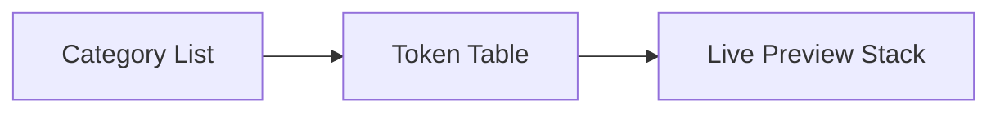

# Design Tokens Spec

## Overview

Expose design tokens (color, typography, spacing, motion, elevation) as first-class entities with documentation, live previews, and integration into stories, permutations, and playroom autocomplete.

## Goals

1. Establish single source of truth for tokens (JSON/Style Dictionary-like).
2. Render docs pages with interactive tables and usage guidelines.
3. Sync tokens to CSS custom properties automatically.
4. Provide APIs for other features (playroom, permutations) to query token values.

### Non-Goals

- Auto-generating tokens from external design tool APIs (manual import for now).

## Token Data Model

```ts
interface TokenCategory {
  id: string;
  label: string;
  description?: string;
  tokens: DesignToken[];
}
interface DesignToken {
  name: string; // e.g., color.background.default
  type: "color" | "dimension" | "font" | "shadow" | "motion";
  value: string;
  attributes?: Record<string, string>;
  deprecated?: boolean;
}
```

- Stored at `design-system/tokens.json`.
- Build script generates:
  - `src/style.css` variable definitions.
  - `src/design-system/tokens.js` export for runtime consumption.

## UX Breakdown

- Docs route `/tokens` with sidebar of categories.
- Each category shows table with name, sample swatch, value, usage notes, copy button.
- Provide theme toggle to preview dark/light differences.
- Search tokens via inline filter.



## Technical Components

- `<fable-tokens-view>` orchestrates layout/state.
- `<fable-token-groups>`: renders grouped token cards with swatches and metadata.
- `<fable-token-detail>`: sticky inspector with copy actions.
- Copy button uses Clipboard API with fallback.

## Build Pipeline

- Script `npm run tokens:sync`:
  1. Read `tokens.json`.
  2. Generate CSS variables grouped by category.
  3. Emit JS module exporting structured tokens.
  4. Optionally emit TypeScript definitions for auto-complete.
- Watch mode integrates with dev server (trigger HMR for CSS + tokens module).

## Integration Points

- Playroom uses tokens for autocomplete (`{token.color.background.default}`).
- Permutations axes can reference token lists (e.g., iterate over semantic colors).
- Docs shortcodes to insert token tables.

## Risks

- **Duplication**: CSS + JS must stay in sync → single script ensures parity.
- **Performance**: Rendering thousands of tokens may be heavy → implement virtual scroll + chunked rendering.
- **Adoption**: Teams must update tokens JSON rather than editing CSS by hand → enforce via lint or CI check.

## Milestones

1. Token data + sync script.
2. Docs page UI.
3. Integration with Playroom/Permutations.
4. Lint/test automation to ensure sync.
