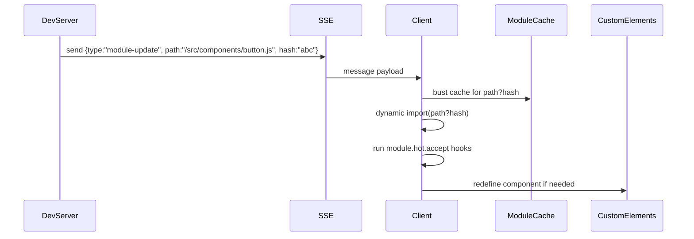

# Hot Module Reload Spec

## Overview

Upgrade the custom dev server from full-page reloads to component-scoped hot module reload (HMR) so developers retain UI state while iterating quickly.

## Goals

1. Detect file changes and push module-level updates via SSE.
2. Re-import changed modules in the browser without dropping current story or controls state.
3. Provide graceful fallback (full reload) on errors with clear overlays.
4. Support component files, store files, styles, and docs markdown reloading.

### Non-Goals

- Advanced React-style hook diffing; rely on module replacement + custom element redefinition.
- Build tool integration (still zero-bundler).

## Developer Experience

- Saving `button.js` re-renders button stories instantly, preserving args/slots and URL.
- Errors show inline overlay with stack trace; editing to fix clears overlay without refresh.
- Stylesheets update in place without flash.

## Technical Breakdown

- **Dev Server**
  - Track dependency graph: parse ES modules for `import` statements (lightweight regex) to know dependents.
  - When file changes, emit SSE event containing path, type (js/css/md), and affected dependents.
  - Provide incremental hash (mtime) for cache busting.
  - Maintain `hmrClients` set; reconnect automatically on server restart.
- **Browser Client**
  - Inject `hmr-client.js` that subscribes to SSE endpoint.
  - Maintain module registry storing last-loaded namespace exports.
  - For JS modules:
    - Use `import(`${path}?hmr=${hash}`)` to fetch new code.
    - Support optional `module.hot.accept(handler)` API to run cleanup.
    - If module defines custom element, wrap `customElements.define` call with `if (!customElements.get(name) || import.meta.hot?.replace)`.
  - For CSS:
    - Replace `<link>` or `<style>` tags by cloning and swapping to avoid flash.
  - For Markdown/Docs:
    - Bust fetch cache and trigger targeted re-render of docs page.
- **Error Handling**
  - SSE can send `type:"error"` with stack trace; client shows overlay component.
  - Provide console logging with grouping for clarity.

## Store & State Considerations

- Keep controls state, selected story, theme untouched.
- Provide `hmrStoreHotSwap(newStoreHandlers)` for modules exporting store logic.

## Dependencies

- Node 20+ file watching (already used).
- URL router integration to avoid reloading entire page.
- Build-time TypeScript for new `hmr-client`.

## Risks

- **Custom elements redefinition**: Browser throws if redefined; must implement `replaceCustomElement(tag, classDef)` helper to unregister (new doc) or use `customElements.whenDefined`.
- **Circular dependencies**: Need to ensure dependent modules reload in right order. Approach: re-import changed module and optionally bubble updates to dependents using queue.
- **Memory leaks**: Event listeners may accumulate; encourage modules to expose `module.hot.dispose(() => cleanup())`.

## Milestones

1. SSE protocol + client script scaffolding.
2. JS module reimport + custom element replacement.
3. CSS + docs handling.
4. Error overlay + DX polish.
