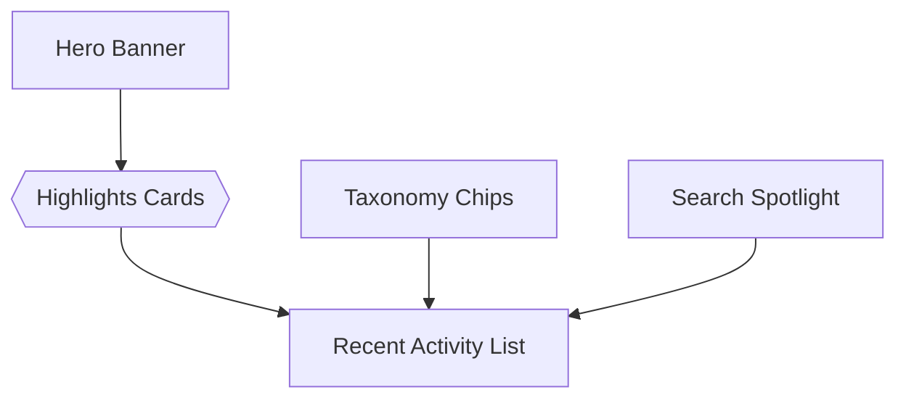

# Homepage / Discovery Spec

## Overview

Provide a landing experience that showcases the breadth of the design system, surfaces new/featured work, and guides users to docs, tokens, and playroom quickly.

## Goals

1. Default route should highlight key content before diving into a specific story.
2. Promote recently added/updated components with metadata-driven cards.
3. Offer entry points to foundations (tokens, icons) and tools (playroom).
4. Integrate taxonomy chips and search suggestions.

### Non-Goals

- Personalized feeds (future idea).
- Editing content from UI (data is derived).

## User Journeys

- *New teammate*: Lands on home, sees “Start Here” hero linking to onboarding docs.
- *Designer*: Checks “Recently Updated” list to know what's changed since last sprint.
- *Engineer*: Uses quick filters to jump to “Forms” components.

## UX Layout

- **Hero banner**: Title, description, CTA buttons (Docs, Playroom).
- **Highlights row**: Cards for Featured doc, Token explorer, Icon gallery.
- **Recent activity**: List of components with timestamp, tags, and “View story” button.
- **Taxonomy chips**: Filter chips (Components, Foundations, Patterns) to update quick lists.
- **Search spotlight**: Pre-filled suggestions (popular searches).

## Data Requirements

- Extend story meta with `createdAt`, `updatedAt`, `featured` flags.
- Central config for hero copy, CTA URLs, highlight cards.
- Aggregated stats (counts per taxonomy) computed on store initialization.

## Technical Design

- **Routing**: `/` defaults to home; selecting a story pushes `/components/{group}/{story}`.
- **Components**:
  - `<fable-home-hero>`
  - `<fable-home-cards>`
  - `<fable-home-activity>`
  - `<fable-chip-group>`
  - `<fable-search-spotlight>`
- **State Flow**:
  - On load, `app-store` derives `recentStories` sorted by `updatedAt`.
  - Taxonomy chip selection filters dataset; home components subscribe to derived selectors.
- **Performance**:
  - Use requestIdleCallback to fetch ancillary data (e.g., Git metadata) if needed.

## Dependencies

- Search/taxonomy dataset.
- Router (view=home) and fallback logic when no story selected.
- Design tokens for styling hero and cards.

## Risks

- **Stale metadata**: `updatedAt` must be maintained → automate via lint/bot if possible.
- **Overcrowded UI**: Need responsive layout; ensure hero condenses on small screens.

## Milestones

1. Router + state changes.
2. Base components (hero, cards, activity).
3. Integration with taxonomy/search data.
4. QA + theming polish.
