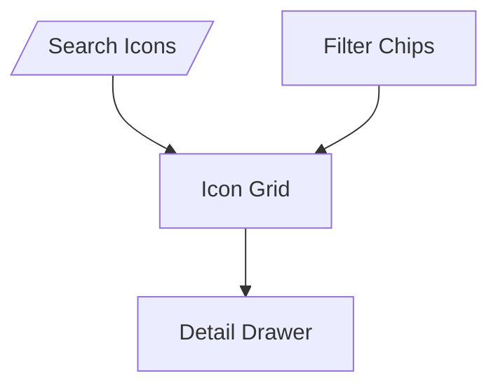

# Icons Documentation Spec

## Overview

Document and showcase the icon library with searchable galleries, usage guidance, and integration into other tooling (playroom palette, docs).

## Goals

1. Central icon manifest with metadata (name, tags, svg path, author, status).
2. Gallery UI with search, filters (filled/outlined, size), background toggles, and copy/download actions.
3. Link each icon to documentation section describing usage guidelines.
4. Provide API for other features to request icon data (palette thumbnails, docs embeds).

### Non-Goals

- Icon editing/drawing within the app.
- Automated sync from third-party icon services (manual import script initially).

## Data Pipeline

- Source SVGs live under `design-system/icons/*.svg`.
- Script `npm run icons:sync`:
  - Reads SVGs, extracts viewBox/path.
  - Generates `design-system/icons.json` manifest.
  - Emits sprite sheet (optional) or ES module exporting icon components.

## UX Layout

- `/icons` route with:
  - Search input (debounced).
  - Filter chips (style: filled, outline; status: new, deprecated).
  - Grid view (virtualized) with preview tiles showing icon at 16/24/32 px toggles.
  - Detail drawer showing name, description, usage guidelines, download button.

## Technical Design

- **Components**
  - `<fable-icon-gallery>`: renders search + grid.
  - `<fable-icon-tile>`: handles preview, background toggle, copy button.
  - `<fable-icon-detail>`: shows metadata and usage copy written in Markdown.
- **Rendering**
  - Use CSS grid + virtualization library (or custom) for smooth scroll.
  - Background toggle cycles between light/dark/transparent for contrast checks.
  - Copy button supports copying as SVG markup or `<fable-icon name="...">`.
- **Detail Drawer**
  - Controlled by router query `?icon=arrow-right`; deep linkable.
  - Displays attributes (category, tags, introduced version) and doc snippet.

## Integration Points

- Search/taxonomy: icons appear under “Foundations > Icons”.
  - Reuse search index to include icon metadata.
- Playroom palette: uses icons manifest to allow inserting icon components quickly.
- Docs: icon detail doc uses same data source for consistency.

## Risks

- **Performance**: Many SVGs may bloat bundle → lazy-load icons via dynamic import or fetch manifest and request SVG on demand.
- **Consistency**: Metadata must be kept up to date (status, tags) → enforce via sync script validations.
- **Accessibility**: Provide guidance for `aria-hidden` vs `aria-label`; ensure icon components support `title` attribute.

## Milestones

1. Icon manifest + sync script.
2. Gallery UI + detail drawer.
3. Search/taxonomy integration.
4. Playroom/doc embedding + QA.
