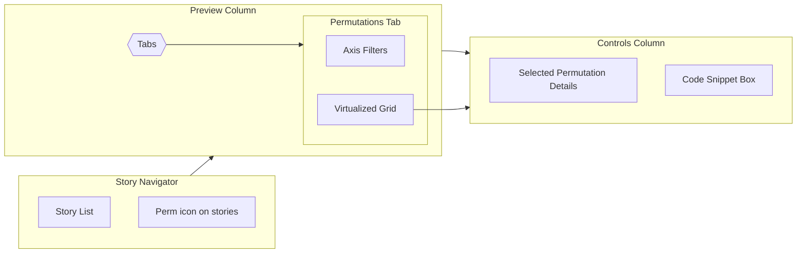

# Permutations Engine Spec

## Overview

Enable authors to define argument axes for a story and let viewers explore every valid combination in a structured grid. This provides a fast way to validate design coverage, document supported states, and copy ready-to-use permutations.

## Goals

1. Let story authors declare permutations metadata alongside args.
2. Render a performant, comprehensible grid inside the preview column.
3. Keep controls/share URLs in sync with selected permutation.
4. Support copying code snippets per cell and exporting tables.

### Non-Goals

- Automatic inference of permutations from code.
- Visual diffing between permutations (future idea).

## User Stories

- *Author*: “As an author I can define axes (size, tone, state) with allowed values and cap total permutations to avoid overload.”
- *Viewer*: “As a designer I can scan all button states at a glance and copy the markup for a specific combination.”
- *QA Engineer*: “I can quickly jump to a permutation and open it as a standalone story URL.”

## UX Breakdown

- Navigator gains a `Permutations` badge next to stories that support it.
- Controls panel adds a tab set: `Controls | Permutations`.
- Default view shows axis selectors on the left (multi-select) and grid on the right.
- Selecting a cell syncs preview + URL query (`?perm=size.medium+tone.solid`).
- Toolbar actions: “Copy HTML”, “Download CSV”, “Open Full Screen”.



## Technical Design

- **Metadata**
  - Extend story meta to accept:
    ```ts
    type PermAxis = { name: string; values: Array<{ label: string; value: string; lockedArgs?: Record<string, unknown> }> };
    interface PermutationsConfig {
      axes: PermAxis[];
      maxCases?: number;
      layout?: "grid" | "list";
    }
    ```
  - Validate at dev-time (lint rule + runtime warning).
- **Processing**
  - Update `processStories` to compute Cartesian product lazily. Use generator that stops when `maxCases` reached.
  - Cache derived permutations per story using weak map keyed by story id + axes hash.
- **Rendering**
  - New `<fable-permutations-view>` handles filters, virtualization (e.g., using `IntersectionObserver` + windowing).
  - Each cell renders story via existing preview iframe but with args merged from selected permutation.
- **State**
  - Store `selectedPermutation` in `app-store`, sync to URL (`/components/button?perm=size.md+tone.solid`).
- **Export**
  - Provide helper `buildPermutationSnippet(story, axisValues)` returning HTML + args JSON.
  - CSV export uses browser `URL.createObjectURL` to download combinations.

## Dependencies

- URL router (for cleaner permutation URLs).
- Search/taxonomy (to expose permutations in filters).
- Requires schema upgrade to include tags + permutations.

## Risks & Mitigations

- **Performance**: Large grids may freeze UI → enforce `maxCases` and virtualization.
- **Memory**: Rendering multiple Lit instances per cell → reuse pre-rendered templates via static clones when args identical.
- **Complex metadata**: Hard for authors to write → consider helper generator or CLI to scaffold axes.

## Milestones

1. Schema & validation.
2. Store + URL support.
3. UI components + virtualization.
4. Export tooling + polish.
