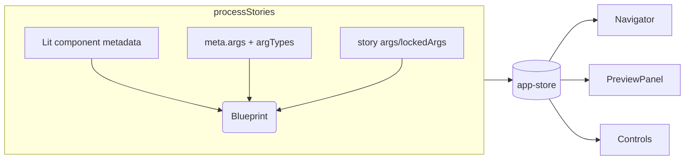

# Permutations Engine Spec

## Overview

Generate permutation grids for every component story automatically by inferring axes and allowed values directly from the code we already ship (Lit custom elements, `meta.args`, story definitions, and `lockedArgs`). Authors no longer write bespoke permutations metadata; instead, the runtime inspects the component API, synthesizes valid combinations, and surfaces them through the preview panel so designers and engineers can validate coverage with zero extra authoring.

## Goals

1. **Automatic inference** – Derive axes from code signals such as `static properties` enums, boolean props, `meta.argTypes.options`, and observed story args (e.g., the `Disabled` story in `src/design-system/checkbox.js:52` that pins `disabled: true`). No hand-authored `meta.permutations` blocks.
2. **Deterministic datasets** – Produce a normalized “permutation blueprint” object for each story during `processStories` so the UI, router, and exports all consume the same source of truth.
3. **Inline validation** – Detect impossible or unsafe combinations (e.g., 5 enums × 3 booleans) and apply guardrails (`maxAxis`, `maxCases`) with developer warnings.
4. **Shareable UX** – Keep navigator badges, tabs, code snippets, CSV export, and URL sync, but annotate that permutations are auto-generated (e.g., “Auto” chip next to the tab label).

### Non-Goals

- Asking authors to maintain static permutations metadata files.
- Building a visual diffing workflow between permutations (can build later once inference is trusted).
- Compiling permutations at build time — inference runs in the browser so it always reflects live components.

## Personas & Stories

- *Component author*: “I expose enums on `FableBadge` via `static properties.variant.enum`. Fable should notice and render every variant × size combination without extra configuration.”
- *Designer*: “I can skim a permutations tab, trust that it mirrors the current component API, and copy the markup for `variant=beta / size=condensed` even if no dedicated story exists.”
- *QA engineer*: “When I change a boolean arg in the controls panel, the selected permutation updates and the URL encodes it so I can refresh or share the exact cell.”

## Autogenerated Signal Graph

### Signals we inspect

1. **Component metadata** – `customElements.get(meta.component)` exposes `static properties`. We can read `enum`, `type`, `reflect`, defaults, and optional `permutationHints` (new optional static field).
2. **Story metadata** – `meta.args`, `meta.argTypes`, and `meta.lockedArgs` provide defaults, control types, and fields that should never be permuted (e.g., slots that the story locks to docs prose).
3. **Story implementations** – Iterate over each entry in `stories`:
   - If it is a function, capture the args passed in via `args(baseArgs)` to learn concrete values.
   - If it is an object, merge `lockedArgs` and inspect `args` functions for overrides.
   - Record which keys vary across stories to infer “story-provided” canonical states (`Disabled`, `Secondary`, etc.).
4. **Runtime args** – After inference we still pass every permutation through the existing renderer once (offscreen) to ensure no exceptions occur before surfacing it.

### Heuristics

| Priority | Rule | Example |
| -------- | ---- | ------- |
| 1 | Take `componentClass.properties.<key>.enum` as the canonical axis values. | `variant` in `src/design-system/button.js:17` ⇒ axis with `["primary","secondary"]`. |
| 2 | For booleans (type `Boolean`) that are not locked, create a two-value axis. | `disabled` on Button/Checkbox. |
| 3 | Harvest `meta.argTypes.<key>.options` when no enum exists. | `size` select options in `src/design-system/badge.js:112`. |
| 4 | Analyze `story.lockedArgs` clusters; if multiple stories pin the same key to different literals, treat those literals as axis values. | Badge stories lock `variant` to alpha/beta/etc. |
| 5 | Detect derived values returned by `story.args(baseArgs)`; if functions always return a literal for a key, add it as a candidate.
| 6 | Allow opt-out or additional hints via an optional `static permutationHints = { skip: ["tooltip"], include: { tone: ["info","danger"] } }` on the component class. Because hints live next to the component implementation, they still count as “code-defined,” not manual spec work.

We cap axes per component to `MAX_AXES = 4` and total combinations to `MAX_CASES = 48` (configurable). If inference would exceed the budget, axes with the lowest confidence score (see below) are trimmed and the UI shows a warning tooltip.

### Confidence scoring

- Each signal contributes a weight (`enum = 1.0`, `argTypes.options = 0.7`, `story lockedArg = 0.5`, `args() literal = 0.4`, `boolean property = 0.3`).  
- When two signals agree on the same value we sum their weights.  
- Values below `0.4` by default are ignored to avoid noise.
- The analyzer stores `{ value, confidence, source }` on every axis entry so the UI can surface tooltips like “Auto-detected from `lockedArgs` (Disabled story)”.

## Data Model & APIs

```ts
type PermutationBlueprint = {
  storyId: string;
  axes: Array<PermutationAxis>;
  baseArgs: Record<string, unknown>; // derived from meta.args + defaults
  lockedArgs: Record<string, boolean>;
  budget: { maxAxes: number; maxCases: number; estimatedCases: number; dropped: string[] };
  warnings: string[];
};

type PermutationAxis = {
  id: string;            // `variant`
  label: string;         // Title-cased for UI
  type: "enum" | "boolean" | "derived";
  values: Array<{
    id: string;          // slug (beta)
    label: string;       // "Beta"
    args: Record<string, unknown>; // { variant: "beta" }
    source: "enum" | "argTypes" | "story" | "hint";
    confidence: number;
  }>;
};
```

- `src/utils/story-processor.js` gains `analyzePermutations(story)` and returns a blueprint stored on `story.meta.permutationBlueprint`.
- `src/store/app-store.js` caches `selectedPermutation` + `permutationBlueprints` keyed by `[groupIndex, storyName]`.
- `src/utils/url-manager.js` encodes selected axis values as `?perm=variant.beta+disabled.false`.  
  Router updates parse this format so direct navigation selects the matching cell.

## Runtime Flow

1. `app.js` loads stories → `processStories`.
2. For each `{ meta, stories }`:
   - Read the component class via `customElements.get(meta.component)`.
   - Assemble `baseArgs` (existing behavior).
   - Pass `meta`, `stories`, and `componentClass` into `analyzePermutations`.
3. Analyzer emits a blueprint; store it on `story.meta.permutationBlueprint` plus a simplified flag `story.meta.hasAutoPermutations`.
4. `fable-story-preview` renders the existing view plus a new `<fable-permutations-view>` that consumes the blueprint.
5. When the user clicks a permutation cell we merge `baseArgs + axis args` and call the already-existing `selectStory` / `updateArg` flows so state, preview, and URL stay in sync.

## UX Breakdown

- **Navigator** – Display a sparkline icon next to stories with `hasAutoPermutations`. Tooltips mention “Auto-generated from component code”.
- **Tabs** – `Controls | Permutations`. The tab label gains a pill showing how many axes were inferred (e.g., `Permutations • 3 axes`).
- **Filters rail** – Left column lists axes. Each axis chip indicates its source (enum, boolean, story). Users can temporarily disable axes.
- **Grid** – Virtualized grid/list hybrid: lock axes >2 entries to grid mode; single-axis cases render a column list. Cells show inline controls for copy HTML/args JSON.
- **Toolbar** – Copy code, download CSV, open in new window (existing requirements).  
  When `estimatedCases > maxCases`, show “Auto-pruned to X combinations” message.
- **URL + share** – Same query syntax as before but with an additional `auto=1` flag to help debugging.



## Export & Validation

- **Copy HTML / Args JSON** – Reuse `buildStoryURL` + `getStorySource`, injecting axis args. Include a comment header `<!-- Auto permutation: variant=beta, size=condensed -->`.
- **CSV download** – Build rows from `axes` metadata and include `confidence` so QA can filter suspect rows.
- **Playground & Docs integration** – Because blueprints live beside metadata, search/taxonomy (see `docs/specs/search-taxonomy.md`) can surface “Has permutations” filters without extra author input.

## Dependencies

- Router updates from `docs/specs/router.md` (parse `?perm=` tokens).
- Search/taxonomy spec to expose permutations in filters and homepage cards.
- Metadata schema (ADR 0001) only needs to allow the runtime to store derived permutation info; no new required author fields.

## Risks & Mitigations

- **Over-generation** – On components with large enums the analyzer could explode combinations. Mitigation: enforce budgets and surface “dropped axis” warnings plus `permutationHints.skip`.
- **Incorrect inference** – Confidence scoring + warning badges in the tab highlight uncertain axes so authors can add hints in code.
- **Performance** – Running inference on load must stay fast. Analyzer caches component fingerprints (hash of `componentClass.properties` + story signatures) and skips re-work if unchanged during HMR.
- **Visual regressions** – Grid virtualization is required after ~30 cells; reuse the virtualization primitives planned for the icons grid to avoid repeated work.

## Milestones

1. **Analyzer foundation** – Build `analyzePermutations`, add hints contract, surface `hasAutoPermutations` flag.
2. **UI integration** – New permutations tab, axis filters, grid rendering, shareable URLs.
3. **Exports + QA tooling** – Snippets, CSV, warning badges, search/hompage integration.

## Open Questions

- Should slot content (e.g., the default slot string examples in `src/design-system/button.js`) ever become an axis, or do we scope permutations strictly to args?
- How do we treat async data/side effects? Some stories may fetch data in `firstUpdated`; do we need a timeout to skip permutations that fail to settle quickly?
- When multiple stories mutate the same arg through functions (e.g., `args: (base) => ({ ...base, disabled: true })`), do we favor the story names as labels (“Disabled”) or the literal value (“disabled=true”)?
