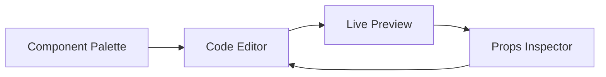

# Playroom Composer Spec

## Overview

Build an in-app composition environment inspired by SEEK's Playroom where designers and engineers can assemble UIs, experiment with tokens, and share interactive prototypes directly from Fable.

## Goals

1. Provide dual-pane editor (code + live preview) with component palette.
2. Offer drag-and-drop layout plus editable DSL (HTML-like with bindings).
3. Enable shareable URLs and “Save as Story” workflow.
4. Integrate design tokens and component metadata for autocomplete/intellisense.

### Non-Goals

- Collaborative multi-user editing.
- Persistent server-side storage (initially URL/localStorage).

## User Journeys

- *Designer*: Drags Button + Input components into canvas, tweaks props via side panel, shares link with engineer.
- *Engineer*: Pastes snippet into editor, sees live preview, saves as new story to commit later.
- *Researcher*: Switches tokens/themes to produce variant prototypes quickly.

## UX Layout

- **Header**: Title, breadcrumbs, actions (Copy Link, Save as Story, Export Code).
- **Left Panel**: Component palette with search + categories; drag items into editor or click to insert snippet.
- **Center**: Monaco editor with HTML-like DSL.
- **Right Panel**: Live preview iframe + props inspector for selected node.
- **Footer**: Theme/token toggles, status (lint/errors).

## DSL Definition

- Based on HTML with custom attributes:
  - Props via regular attributes (`variant="primary"`).
  - Slots using `<template slot="...">`.
  - Tokens via `{token.color.background}` interpolation.
- Support JS expressions inside `{}` limited to referencing args or tokens.
- Parse with `@webcomponents/template-parser` or custom AST using `htmlparser2`.

## Technical Design

- **Editor**
  - Monaco loaded via CDN; configure custom language `fabledsl`.
  - Provide autocomplete using component metadata (name, props, descriptions) + token names.
  - Lint rule warns for unsupported props or invalid token references.
- **Palette**
  - Data derived from story metadata (component name, icon, description).
  - Drag events insert snippet into editor selection.
- **Preview**
  - Runs inside sandboxed iframe to isolate errors.
  - On code change, send message to iframe which rehydrates layout (no reload).
  - Provide error overlay inside iframe with stack trace.
- **Inspector**
  - Parse AST, allow selecting node to edit props via form; edits sync back to editor text (via range replacements).
- **Share & Save**
  - Serialize DSL string, compress using LZ-string, encode into URL hash `#playroom=...`.
  - “Save as Story” exports snippet template + default args for manual inclusion (copy to clipboard).
  - Local drafts stored in IndexedDB with timestamp list.

## Integration Points

- Router: `/playroom` route.
- Tokens + icons metadata for autocomplete + palette previews.
- Search/taxonomy to categorize palette items.

## Risks

- **Bundle size**: Monaco is heavy → lazy-load only when entering playroom and leverage dynamic imports.
- **Parsing sync**: Keeping editor text, AST, and inspector state aligned can be tricky → centralize AST updates and use incremental parsing.
- **Security**: Executing user-entered HTML/JS must be sandboxed → use iframe with `sandbox` attribute and disallow inline scripts.

## Milestones

1. Route + base layout (palette/editor/preview shells).
2. DSL parser + preview runner.
3. Palette + autocomplete integration.
4. Share/save workflows and inspector polish.
