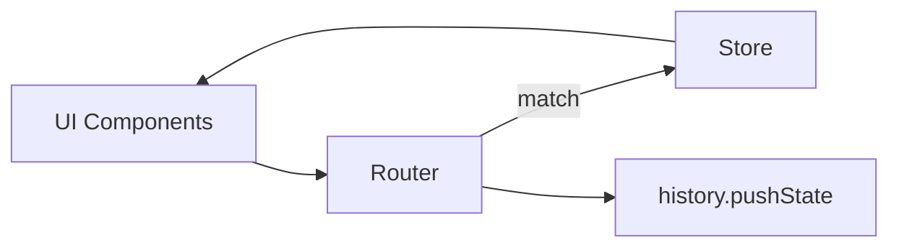

# URL Router Spec

## Overview

Adopt the browser-native `URLPattern` API to create a declarative router that supports clean hierarchical paths, improved shareability, and integration with new views (home, docs, playroom, permutations). No legacy query-mode compatibility or polyfill is required; break old URLs in favor of the new structure.

## Goals

1. Map semantic URLs (`/components/{group}/{story}`, `/docs/{section}/{slug}`, `/playroom`) to view state.
2. Provide centralized router module emitting navigation events to the store.
3. Support param parsing for permutations and filters via query strings.

### Non-Goals

- History management beyond pushState/replaceState.
- Server-side routing (pure client).

## Routes

| Path Pattern | View | Notes |
|--------------|------|-------|
| `/` | Home | Default discovery page |
| `/components/:group/:story` | Story view | Optional `?perm=...` |
| `/docs/:section/:slug` | Docs stories |
| `/playroom` | Playroom composer |
| `/tokens/:category?` | Design tokens |
| `/icons` | Icon gallery |

## Router Architecture

- **Module**: `src/router.js`
  - Initializes `URLPattern` instances per route.
  - Exposes `navigateTo(path, options)` and `router.subscribe(callback)`.
  - Listens to `popstate` and dispatches matched route payload.
- **Store Integration**
  - Router dispatches actions (`SET_VIEW`, `SELECT_STORY`, etc.).
  - Navigation from UI uses router instead of manual URL updates.
- **URL Generation**
  - Helper `buildStoryURL({ group, story, params })`.
  - Ensure percent-encoding of args/permutations.

## Migration Plan

1. Ship router with path-first navigation only (no query fallback).
2. Update sharable links (copy button) to use new format.
3. Document the breaking change and expected new URL shapes.

## Edge Cases

- Unknown route → 404 component (`src/404.html`) or redirect to home.
- Query-only filters (search, taxonomy) remain as `?status=beta` appended to base path.
- Router should support optional trailing slashes.

## Testing Strategy

- Unit tests for `matchRoute` with sample paths.
- Integration test (Playwright) verifying navigation + history.
- Manual verification of legacy URLs.

## Dependencies

- Browser support: `URLPattern` (Chromium 95+, Firefox 120+, Safari 17+); no polyfill required.
- Store actions for new views (home, docs, playroom, tokens, icons).

## Risks

- **Deep linking**: Must ensure resources loaded before router tries to render (especially docs fetch) → router waits for store ready promise.
- **SEO**: Not primary focus but ensure server 200 for deep links via dev server fallback.

## Milestones

1. Router module + store integration.
2. Route component mappings (home/docs/story).
3. Legacy redirect + copy-link updates.
4. Automated tests + polyfill distribution.
