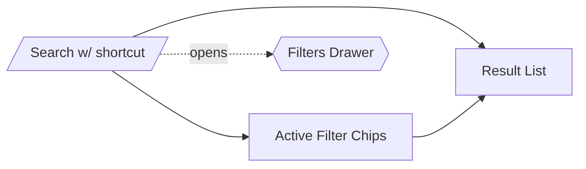

# Search & Taxonomy Spec

## Overview

Implement instant search and structured taxonomy filters so users can locate components, docs, tokens, and tools quickly across a growing system.

## Goals

1. Global search box with typeahead results grouped by entity type.
2. Taxonomy facets (component family, platform, status, accessibility level) that filter navigator/home content.
3. Metadata schema to capture tags/status/platform on every story/doc.
4. Integrate search results with router URLs and keyboard navigation.

### Non-Goals

- Full-text search over external docs.
- Server-side indexing (client-only for now).

## User Journeys

- *Designer*: Types “button” and sees docs, permutations, and tokens results.
- *Engineer*: Filters to “mobile” platform components to ensure parity.
- *PM*: Looks for all “Beta” status components.

## UX Breakdown

- Search input anchored at top of navigator with `/` keyboard shortcut.
- Results dropdown groups by type (Components, Docs, Tokens, Icons).
- Filters drawer slides out from navigator side with checkboxes for taxonomy facets.
- Active filters represented as chips below search input; each chip removable.



## Metadata Schema

```ts
interface TaxonomyMeta {
  tags: string[];
  status: "stable" | "beta" | "deprecated";
  platforms: Array<"web" | "ios" | "android">;
  accessibility: "baseline" | "enhanced";
  group: string; // Component family, e.g., "Inputs"
}
```

- Add optional `keywords` array for search synonyms.
- Provide centralized taxonomy definition file for allowed values + ordering.

## Technical Design

- **Indexing**
  - Build normalized dataset on app init containing search tokens (title, tags, keywords).
  - Use lightweight library (Fuse.js) with fields weighting; fallback to custom scoring for zero-dependency mode.
  - Debounce input (150ms) and support prefix matching.
- **Filters**
  - New `filtersSlice` in store storing active facets.
  - Derived selectors combine search results + filters to produce final list.
  - Navigator and home components subscribe to filtered data.
- **Keyboard Support**
  - `/` focuses search, `Arrow` keys navigate results, `Enter` selects (navigates via router).
  - Provide `Cmd+K` alias to align with command palette expectations.
- **Persistence**
  - Save last filters to `localStorage` keyed by version; include in shareable URLs via query `?status=beta&platform=ios`.

## Dependencies

- Router (for linking to result targets).
- Taxonomy data consumed by homepage, permutations, docs.
- Lint tooling to ensure metadata completeness (could extend Biome rule or custom script).

## Risks

- **Metadata drift**: Without enforcement, search quality suffers → integrate with CI to validate allowed values.
- **Performance**: Large result sets may lag → limit to top N results and paginate in navigator list.
- **Accessibility**: Search dropdown must be aria-compliant; use `role="listbox"` and manage focus.

## Milestones

1. Define taxonomy schema + lint rule.
2. Build search index + UI.
3. Implement filters drawer + chips.
4. Integrate with navigator/home + finalize persistence.
